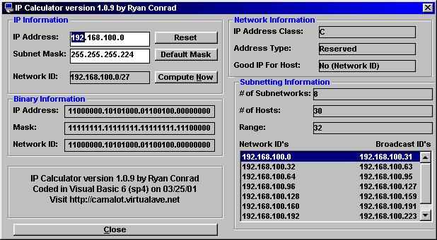



## IP Subnetting Calculator v 1\.0\.9

### Description

Enter in an IP address and subnet mask and will return information about that IP and network ID. Tells what the network ID is for that IP, All Possible network ID possible from mask, number of hosts allowed on each network, number of subnets allowed from Mask, Number of bits userd in mask, Lists all Network ID's and Broadcast ID's, what class the IP is, If the IP is reserved or public, if the IP is good to assign to a host.

Please post comments and questions. Don't for get to vote.
 
### More Info
 

             |
---                |---
**Submitted On**   |2001-04-02 12:02:18
**By**             |[whiteknight](https://github.com/Planet-Source-Code/PSCIndex/blob/master/ByAuthor/whiteknight.md)
**Level**          |Intermediate
**User Rating**    |4.6 (165 globes from 36 users)
**Compatibility**  |VB 6\.0
**Category**       |[Internet/ HTML](https://github.com/Planet-Source-Code/PSCIndex/blob/master/ByCategory/internet-html__1-34.md)
**World**          |[Visual Basic](https://github.com/Planet-Source-Code/PSCIndex/blob/master/ByWorld/visual-basic.md)
**Archive File**   |[IP Subnett17841422001\.zip](https://github.com/Planet-Source-Code/whiteknight-ip-subnetting-calculator-v-1-0-9__1-22100/archive/master.zip)

